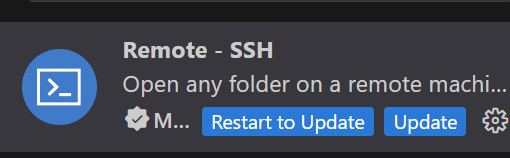
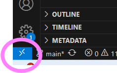

# VI-Live-Workshop-For-BE

Welcome to VI Live workshop!
You will get to know Nvidia's deepstream in this hands on workshop. 
The labs will demonstrate the most basic features and capabilities.

Hopefully this will give you a better understanding of the amazing features and capabilities of Nvidia's Deepstream, and how amazing VI Live will be.

## Prerequisites

Connect to AzVpn

## Workshop Content

[Workshop Setup](#Setup)
- [Lab 1 - Creating 4 different pipelines](./src/Lab1)
- [Lab 2 - Creating a pipeline with multiple inputs](./src/Lab2)

## Setup

### Steps

We will use [ts-gpu-deepstream](https://ms.portal.azure.com/#@microsoft.onmicrosoft.com/resource/subscriptions/24237b72-8546-4da5-b204-8c3cb76dd930/resourceGroups/yl-try-rg/providers/Microsoft.Compute/virtualMachines/ts-gpu-deepstream/overview)

#### Setting up key and verifying connection to the VM

1. In the Go to "Help" -> "Reset password" and
1. Choose "Add SSH public key"
1. **Username**: azureuser
1. **SSH public key source**: Generate new key pair
1. **SSH Key Type**: Ed25519
1. **Key Pair name**: ts-gpu-deepstream-key
1. Click **Update**
1. A window will popup allowing you to download the key.
   
    Download and save the key under C:\Users\\\<username>\\\.ssh\\ts-gpu-deepstream-key

#### Connecting to the VM from VSCode

1. Connect to AzVpn
1. Install "Remote - SSH" extension
        
    
1. In VSCode, on the bottom left, click on the double arrow >< sign


1. Click "Connect to host"
1. Click on "Configure SSH Hosts" (choose the file that starts with "C:Users...")
1. Update config file as follows and save:
      ```
      Host 40.124.109.198
         HostName 40.124.109.198
         User azureuser
         IdentityFile ~/.ssh/ts-gpu-deepstream-key.pem
      ```
1. Click  on the double arrow again and choose"Connect to Host"
1. Paste azureuser@40.124.109.198 (for example azureuser@40.124.109.198)
1. Choose linux os
1. Click on file explorer and choose "Open folder". Choose path to "VI-Live-Workshop-For-BE"

#### Connecting to Dev Container within the VM

In Lab1 and Lab2 you will run the example in Dev Containers. In order to do this you need to ctrl+shift+p and choose "Dev Containers: Open Folder in container". Choose the folder of the workshop.